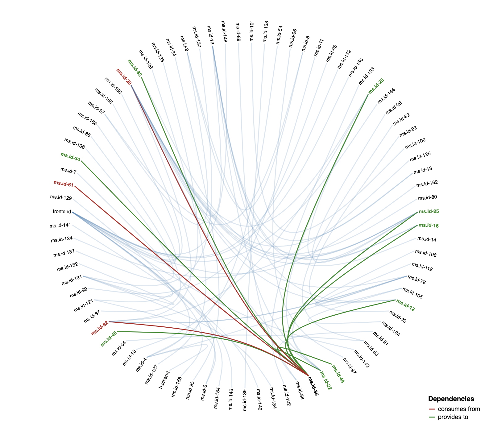
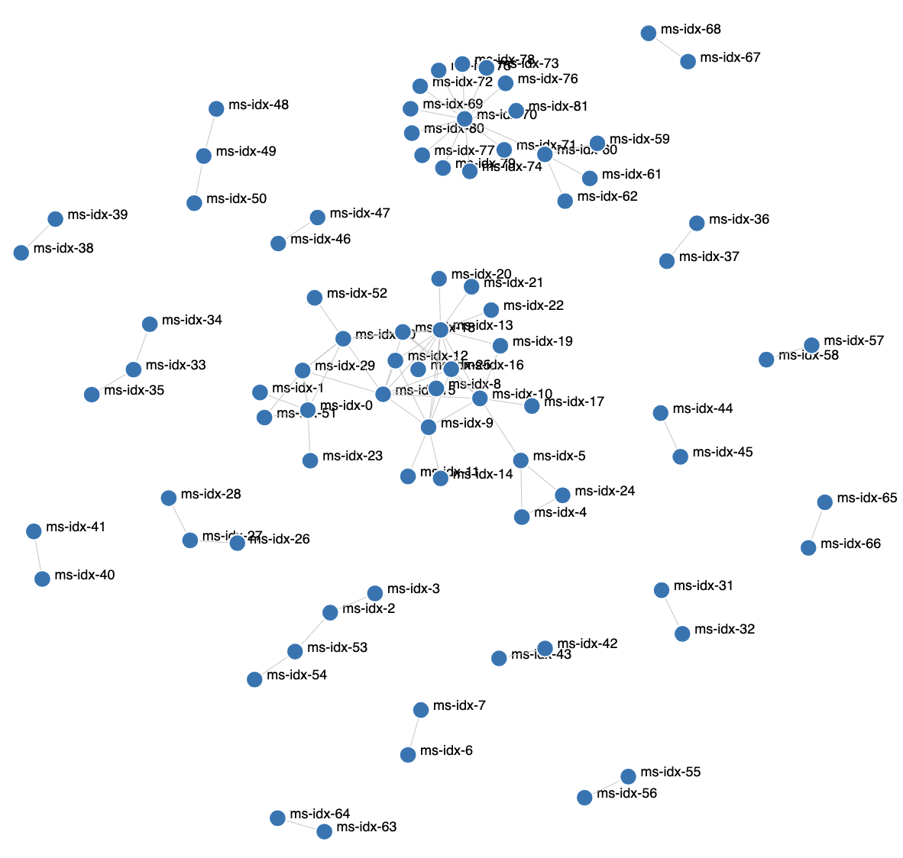

# Pact graph network
[](https://choosealicense.com/licenses/mit/)
[](https://github.com/ManoManoTech/pact-graph-network/actions)
[](https://www.rust-lang.org/)


A command line to generate dependency patterns between microservices using pact-broker data.

Available for linux, alpine and OSX.


# Table of contents

- [Screenshots](#screenshots)
- [Tech Stack](#tech-stack)
- [Features](#features)
- [How to install](#how-to-install)
- [Usage](#usage)
- [Environment Variables](#environment-variables)
- [Feedback](#feedback)
- [License](#license)

## Screenshots

<div>
  
  
</div>

## Tech Stack

This project is created with:

- [rust](https://www.rust-lang.org/) 🦀
- [D3js](https://d3js.org/)

## Features

- [x] generate an html report
- [x] generate an edge bundling chart
- [x] generate a force directed layout chart
- [x] exclude sevices with pattern
- [ ] filter only services
- [ ] add support fort Pact Broker authentification

## How to install

```bash
# Download the binary
VERSION=0.7.2
curl -L -o $HOME/.local/bin/pact-graph-network \
  https://github.com/ManoManoTech/pact-graph-network/releases/download/v${VERSION}/pact-graph-network_x86_64-unknown-linux-gnu

# Make it executable
chmod u+x $HOME/.local/bin/pact-graph-network
```

## Usage

~~~bash
  pact-graph-network \
  --url https://pact-brocker.your.com/ \
  --output report
~~~

### Options 

```
-u, --url <URL>          Pact broker URL
-o, --output <OUTPUT>    Path of the output dir [default: report]
-g, --graph <GRAPH>      [default: edge] [possible values: edge, directed]
    --timeout <TIMEOUT>  timeout of http request in milliseconds [default: 2000]
    --exclude <EXCLUDE>  list of service to exclude
-h, --help               Print help information
-V, --version            Print version information
```

### Environment Variables

| Key                          | Description                                   | Alowed values                         |
| ---------------------------- | --------------------------------------------- | ------------------------------------- |
| **`PACT_NETWORK_LOG`**       | Adds filters to the logger.                   | `error`,`warn`,`info`,`debug`,`trace` |
| **`PACT_NETWORK_LOG_STYLE`** | Whether or not to print styles to the target. | `auto`, `always`, `never`             |


## Feedback

If you have any feedback, please open an issue.

## License

[MIT](https://choosealicense.com/licenses/mit/)
